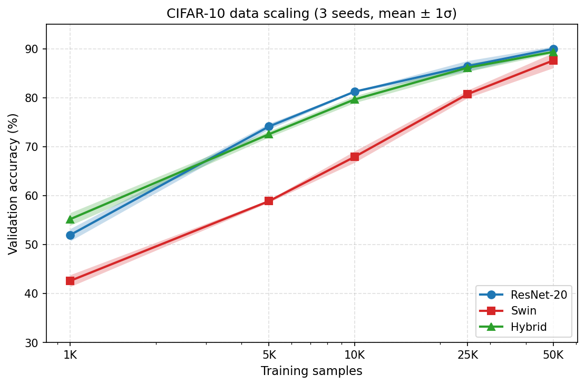

# CIFAR-10 Architectural Evolution

A comparative study of CIFAR-10 architectures, tracing the evolution from classical linear classifiers through modern vision transformers, hybrids, and ImageNet-pretrained transfer learning. From-scratch models share a common training backbone (same data pipeline, AdamW optimizer, cosine annealing LR), with architecture-appropriate hyperparameters (warmup length, weight decay, stochastic depth). This is not a strictly controlled experiment (each model uses settings suited to its architecture) but results stay within the range reported in the literature for each family.

## Results

### From scratch (32x32, 50K images)

| Model | Params | Val Acc | Train Acc | Overfit Gap | Epochs |
|-------|--------|---------|-----------|-------------|--------|
| SVM (RBF Kernel) | 41K | **49.5%** | 56.5% | 7.0% | 200 |
| MLP (3-layer FC) | 3.8M | **58.7%** | 91.1% | 32.4% | 95* |
| CNN (3-block Conv) | 406K | **87.3%** | 92.4% | 5.2% | 100 |
| ResNet-20 | 272K | **89.9%** | 99.0% | 9.6% | 123* |
| Swin Transformer | 5.4M | **86.6%** | 96.7% | 10.1% | 117* |
| Hybrid CNN-Transformer | 1.16M | **90.4%** | 99.6% | 9.2% | 133* |

### Transfer learning (ImageNet pretrained, fine-tuned at 224x224)

| Model | Params | Val Acc | Train Acc | Epochs |
|-------|--------|---------|-----------|--------|
| ResNet-18 (ImageNet) | 11.2M | **96.6%** | 100.0% | 50 |
| Swin-T (ImageNet) | 27.5M | **97.4%** | 99.5% | 32 |

\* Early stopped (patience=15 on val/acc).

### Efficiency (RTX 2060 SUPER, batch=128, FP16)

| Model | FLOPs | ms/batch | Acc/MFLOP |
|-------|-------|----------|-----------|
| SVM | 12.6M | 0.4ms | 3.92 |
| MLP | 3.8M | 0.6ms | 15.43 |
| CNN | 40.1M | 1.6ms | 2.18 |
| ResNet-20 | 41.8M | 4.4ms | 2.15 |
| Swin | 133.5M | 10.4ms | 0.65 |
| Hybrid | 255.1M | 13.6ms | 0.35 |
| ResNet-18 (pretrained, 224x224) | 1.83G | 38.6ms | 0.05 |
| Swin-T (pretrained, 224x224) | 4.51G | 182.9ms | 0.02 |

Among from-scratch models, ResNet-20 remains the efficiency king — at 50K it matches the Hybrid's accuracy (see Data scaling below for 3-seed aggregates) at ~1/6 the FLOPs. Pretrained models win on accuracy but pay a steep cost: pretrained Swin-T uses **108x more FLOPs** than ResNet-20 and is **42x slower** per batch — for a +7.5% accuracy gain. Pretrained ResNet-18 is more practical: **44x more FLOPs** and **8.8x slower** for +6.7%. If you only need good accuracy on small images, from-scratch ResNet-20 still delivers >90% of the ceiling at a fraction of the cost.

### Key findings

1. **SVM → MLP (+9.2%)**: 93x more parameters buy marginal gains. Without spatial awareness, fully connected layers memorize rather than generalize (32% overfit gap).
2. **MLP → CNN (+28.6%)**: The biggest jump. Spatial inductive bias (local connectivity, weight sharing) achieves 87% with 10x fewer params than the MLP.
3. **CNN → ResNet (+2.6%)**: Skip connections enable deeper, more efficient learning with 33% fewer params.
4. **ResNet → Swin (-3.3%)**: The surprise. 20x more parameters and a more expressive architecture *loses* to ResNet. On 50K 32x32 images, there isn't enough data for transformers to learn the spatial structure that convolutions get for free. With aggressive augmentation (RandAugment, CutMix) or pretraining, Swin reaches 90–97% on CIFAR-10 — but under this training recipe, convolutions win. The [Data scaling](#data-scaling-3-seeds) section below confirms this is a data problem, not an architecture problem: Swin's slope from 10K→50K is more than 2× ResNet's.
5. **Hybrid ≈ ResNet at 50K, wins only in low data**: Conv early stages + Swin late stages gives the transformer the spatial inductive bias it can't learn from so few samples. Across 3 seeds at 50K, Hybrid averages 89.34% vs ResNet's 89.96%: essentially tied, or slightly behind (the 90.4% in the top table was a favorable seed). Hybrid's real win is at 1K, where it beats ResNet by **+3.2%**: conv features rescue attention when data is scarce. The conv/attention combo isn't a free lunch: it's a small-data insurance policy.
6. **Pretraining dominates architecture**: Both pretrained models crush every from-scratch baseline: ResNet-18 (96.6%, +6.2% over best from-scratch) and Swin-T (97.4%, +7.0%). The +10.8% jump from from-scratch Swin (86.6%) to pretrained Swin-T (97.4%) is the vindication: Swin's poor from-scratch performance was a **data problem, not an architecture problem**. Once features are well-trained on ImageNet's 1.2M images, attention's global receptive field edges out convolutions by +0.8% (Swin-T over ResNet-18). The from-scratch conclusion reverses: **with enough data, transformers catch up; without it, convolutions win**.

### Per-model details

<details>
<summary>SVM (RBF Kernel via Random Fourier Features) — ~200 epochs</summary>

- Approximates RBF kernel SVM via fixed random projections (Rahimi & Recht, 2007). Only the linear classifier is trainable.
- **49.5% matches the literature** for kernel SVM on raw CIFAR-10 pixels (expected: 50–55%).
- The ceiling is the representation: fixed random projections cannot capture spatial structure.
</details>

<details>
<summary>MLP (3-layer FC) — early stopped at 95 epochs</summary>

- 58.7% exceeds typical MLP benchmarks (literature: 53–57%), likely due to modern training recipe (AdamW, cosine annealing, weight decay + dropout).
- 32% train/val gap shows severe overfitting — the model memorizes but can't generalize.
- The ceiling is the architecture: fully connected layers treat each pixel independently.
</details>

<details>
<summary>CNN (3-block Conv + BatchNorm) — 100 epochs, with data augmentation</summary>

- Standard CIFAR-10 augmentation (random horizontal flip + random crop with 4px padding) for all conv-based models.
- +5.1% over no-augmentation baseline (82.2% → 87.3%) — same model, same params, just more diverse training data.
- The ceiling is depth: stacking more conv layers causes vanishing gradients without skip connections.
</details>

<details>
<summary>ResNet-20 — early stopped at 123 epochs, with data augmentation</summary>

- Architecture follows He et al. (2015): 3 stages of {16, 32, 64} channels, 3 blocks per stage.
- +2.6% over CNN with 33% fewer params — skip connections enable more efficient learning, not just deeper networks.
</details>

<details>
<summary>Swin Transformer (CIFAR-10 adapted) — early stopped at ~117 epochs, with data augmentation</summary>

- CIFAR-10 adapted Swin-Tiny: patch_size=2, window_size=4, embed_dim=64, depths=[2,2,6], 3 stages (16x16 → 8x8 → 4x4).
- Transformer-specific training: 10-epoch linear LR warmup, weight_decay=0.05 (vs 1e-4 for CNNs), stochastic depth 0.1.
- 86.6% with 20x more params than ResNet — transformers lack the spatial inductive bias that makes convolutions efficient on small images.
- This matches independent benchmarks: Swin from scratch with basic augmentation reaches 86–90% on CIFAR-10. The 90%+ results in the literature use RandAugment, CutMix, or pretraining.
</details>

<details>
<summary>Hybrid CNN-Transformer — early stopped at ~133 epochs, with data augmentation</summary>

- Conv backbone: 64-channel stem + 2 BasicBlocks (GELU) at 32x32 + stride-2 downsample to 16x16. Reuses ResNet's `BasicBlock`.
- Transformer backbone: 2 Swin blocks at 16x16 + PatchMerging + 4 Swin blocks at 8x8. Reuses Swin's `SwinStage`.
- Transition: reshape + LayerNorm (conv's 64 channels = transformer's 64-dim embeddings, no projection needed).
- Training: weight_decay=0.02, 5-epoch LR warmup — between ResNet's and Swin's settings.
- 90.4% with 1.16M params (single seed) — conv extracts local features cheaply, attention reasons globally. Across 3 seeds this averages to 89.34% (±0.32), essentially tied with ResNet-20. See [Data scaling](#data-scaling-3-seeds) for the full picture.
</details>

<details>
<summary>Pretrained ResNet-18 (ImageNet → CIFAR-10) — 50 epochs, fine-tuned at 224x224</summary>

- Torchvision ResNet-18 with `IMAGENET1K_V1` weights. Head replaced: `Linear(512, 10)`.
- CIFAR-10 upsampled to 224x224 with ImageNet normalization (0.485,0.456,0.406 / 0.229,0.224,0.225).
- Full fine-tuning (no layer freezing): lr=1e-4, weight_decay=1e-4, 3-epoch warmup.
- 96.6% val acc — already hits 91.7% after just 2 epochs, versus 123 epochs for ResNet-20 from scratch to reach 89.9%.
</details>

<details>
<summary>Pretrained Swin-T (ImageNet → CIFAR-10) — 32 epochs, fine-tuned at 224x224</summary>

- Torchvision Swin-T with `IMAGENET1K_V1` weights. Head replaced: `Linear(768, 10)`.
- Same preprocessing as pretrained ResNet-18. Training: lr=1e-4, weight_decay=0.05, 5-epoch warmup, batch_size=64 (fits on 8GB GPU at 224x224).
- 97.4% val acc — a **+10.8% jump** from the 86.6% from-scratch Swin. The architecture was never the problem, the data was.
- Beats pretrained ResNet-18 by +0.8%: with sufficient features, attention's global receptive field finally pays off. The from-scratch conclusion (convs > transformers) reverses with enough data.
</details>

### Data scaling (3 seeds)

Finding #4 claims Swin's poor from-scratch performance is a data problem, not an architecture problem. This experiment tests it directly: ResNet-20, Swin, and Hybrid trained on {1K, 5K, 10K, 25K, 50K} subsets of CIFAR-10, 3 seeds each (45 runs). Each seed drives both model init and subset selection, so variance reflects combined data + training noise. Same training recipe as the top table, but with `--max-epochs 300 --patience 30` so early stopping finds each size's true peak.



| Model      | 1K | 5K | 10K | 25K | 50K |
|------------|-------------|-------------|-------------|-------------|-------------|
| ResNet-20  | 51.96 ±1.25 | 74.11 ±0.59 | 81.23 ±0.11 | 86.46 ±1.09 | 89.96 ±0.49 |
| Swin       | 42.59 ±1.21 | 58.87 ±0.26 | 67.90 ±1.17 | 80.73 ±0.78 | 87.60 ±1.53 |
| Hybrid     | 55.19 ±1.29 | 72.54 ±0.63 | 79.63 ±0.69 | 86.12 ±0.81 | 89.34 ±0.32 |

1. **Swin has the steepest slope — finding #4 vindicated with measurement.** From 10K → 50K (5× data), Swin gains **+19.7%** against ResNet's +8.7% and Hybrid's +9.7%. The gap to ResNet shrinks from −13.3% at 10K to −2.4% at 50K. Extrapolating the 25K→50K slope, Swin would cross ResNet somewhere in the 100K–200K range: consistent with finding #6, where pretrained Swin-T (trained on 1.2M ImageNet images) ends up +0.8% above ResNet-18.
2. **Hybrid wins only in the low-data regime.** At 1K it's the clear best (55.2% vs ResNet 52.0% vs Swin 42.6%). The conv backbone supplies the spatial inductive bias the transformer stages can't learn from so few samples. From 5K onward, ResNet matches or slightly beats Hybrid at every size.
3. **Transformers on small images are seed-sensitive.** Swin's ±1.53% std at 50K is the largest in the sweep: one run reached 89.4% (nearly matching ResNet), the other two stalled near 86.7%. The original single-seed 86.6% landed on the pessimistic side of this distribution, understating Swin's best-case at 50K.
4. **ResNet-20 is boringly consistent.** Lowest std at 3 of 5 sizes. If you want one model that works across data regimes without surprises, it's ResNet-20.

Plots and the 3-seed table above are regenerated from TensorBoard event files by `plot_scaling.py`.

### Knowledge distillation (teacher: ResNet-20)

| Student | Params | Baseline | Distilled | Delta |
|---------|--------|----------|-----------|-------|
| MLP | 3.8M | 55.3% | **59.2%** | **+3.9%** |
| TinyCNN | 56K | 81.3% | **81.7%** | +0.4% |
| CNN | 406K | 87.3% | **87.3%** | 0% |

Teacher logits are precomputed once (`--precompute-teacher`) and reused across all students: no teacher in GPU memory during training. Distillation only helps the MLP meaningfully: the teacher's spatial knowledge raises the train ceiling by 19%, and +3.9% transfers to validation. Conv-based students already have the right inductive bias: soft labels from a slightly better teacher can't break their architectural ceiling.

## Project Structure

```
├── core/
│   ├── data_module.py         # CIFAR-10 data loading and preprocessing
│   └── lightning_module.py    # Universal training wrapper
├── models/                    # Architecture definitions
├── utils/
│   └── metrics_tracker.py     # Parameter and FLOP counting (fvcore)
└── train.py                   # Entry point
```

## Setup

```bash
conda create -n cifar10-evo python=3.11 -y
conda activate cifar10-evo
python -m pip install torch torchvision --index-url https://download.pytorch.org/whl/cu128
python -m pip install -r requirements.txt
```

## Usage

```bash
python train.py --model svm                         # train from scratch
python train.py --model cnn --max-epochs 200        # custom epoch count
python train.py --model resnet --ckpt last          # resume from last checkpoint
```

TensorBoard logs are written to `./logs/`. To visualize:

```bash
tensorboard --logdir logs
```

## Tech Stack

PyTorch, PyTorch Lightning, TorchMetrics, TensorBoard, fvcore
